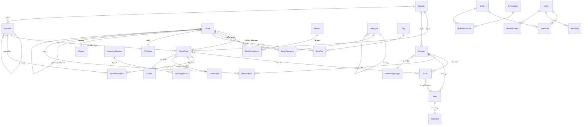

# مدل داده و ERD — سامانه دارین

پایگاه داده: **PostgreSQL 16** · ORM: **Prisma 5** · تمام تغییرات از طریق Migration نسخه‌دار.

---

## ۱. نمای کلی ERD



---

## ۲. تفکیک بنیادین: عنوان در برابر نسخه

این مهم‌ترین تصمیم مدل داده است.

```
Book  (رکورد کتاب‌شناختی — «اثر X»)
 ├── BookCopy #001   بارکد 200000000123 · ثبت 10245 · قفسه B1-A03-SH12-L04 · موجود
 ├── BookCopy #002   بارکد 200000000124 · ثبت 10246 · قفسه B1-A03-SH12-L04 · امانت
 ├── BookCopy #003   بارکد 200000000125 · ثبت 10247 · قفسه B1-A03-SH12-L05 · آسیب‌دیده
 ├── BookCopy #004   ...
 └── BookCopy #005   ...
```

| موجودیت | امانت | رزرو | بارکد | محل | وضعیت |
|---------|-------|------|-------|-----|--------|
| `Book` | ❌ | ✅ (عضو «عنوان» را رزرو می‌کند) | ❌ | ❌ | ❌ |
| `BookCopy` | ✅ | ❌ | ✅ | ✅ | ✅ |

**کتاب چندجلدی:** هر جلد یک `Book` مستقل است با `parentBookId` به رکورد والد و `volumeNumber`.
مثال: «شاهنامه» (والد) → «شاهنامه جلد ۱»، «شاهنامه جلد ۲» … هر جلد ISBN، بارکد و نسخه‌های فیزیکی خودش را دارد.

---

## ۳. درخت مکان (Location Tree)

یک جدول، هشت نوع گره:

```
BUILDING      ساختمان اصلی            code=B1     path=.1.
 └ FLOOR      طبقه اول                code=F1     path=.1.4.
    └ SECTION بخش ادبیات              code=S2     path=.1.4.9.
       └ ROOM اتاق مطالعه (اختیاری)   code=R1     path=.1.4.9.12.
          └ AISLE     راهروی ۳        code=A03    path=.1.4.9.12.30.
             └ SHELF  قفسه ۱۲         code=SH12   path=.1.4.9.12.30.77.
                └ SHELF_LEVEL طبقه ۴  code=L04    path=.1.4.9.12.30.77.301.
                   └ POSITION خانه ۸  code=P08
```

- `fullCode` = `B1-F1-S2-A03-SH12-L04` (به‌صورت خودکار از زنجیره والدین ساخته و روی برچسب چاپ می‌شود)
- `path` = Materialized Path؛ کوئری «همه کتاب‌های بخش ادبیات» = یک `LIKE '.1.4.9.%'` روی Index
- `capacity` روی گره‌های `SHELF` و `SHELF_LEVEL` → محاسبه فضای خالی
- `qrToken` روی هر گره → اسکن QR قفسه صفحه‌اش را باز می‌کند

هر `BookCopy` به یک گره (معمولاً `SHELF_LEVEL`) وصل است + `positionCode` اختیاری برای خانه دقیق.

---

## ۴. جدول‌های اصلی

### ۴.۱ کاتالوگ
| جدول | نقش | کلیدهای یکتا |
|------|-----|--------------|
| `Book` | رکورد کتاب‌شناختی | — |
| `Person` | نویسنده/مترجم/ویراستار/گردآورنده (Authority Record) | — |
| `BookContributor` | ارتباط N:M با `role` و `order` | `(bookId, personId, role)` |
| `Publisher` | ناشر | — |
| `Series` | مجموعه | — |
| `Category` | درخت موضوع/ژانر | `(parentId, name)` |
| `BookCategory` | ارتباط N:M + `isPrimary` | `(bookId, categoryId)` |
| `Tag` / `BookTag` | برچسب | `Tag.slug` |
| `Donor` | اهداکننده | — |

### ۴.۲ موجودی فیزیکی
| جدول | نقش | یکتایی |
|------|-----|--------|
| `BookCopy` | نسخه فیزیکی | `barcode` (سراسری)، `(branchId, accessionNumber)`، `(branchId, assetNumber)` |
| `BookMovement` | تاریخچه جابه‌جایی | — |
| `Location` | درخت مکان | `(branchId, fullCode)` |

### ۴.۳ اعضا و امانت
| جدول | نقش | یکتایی |
|------|-----|--------|
| `Member` | عضو | `memberCode`، `nationalId` |
| `MembershipType` | قوانین عضویت (سقف امانت، مدت، جریمه) | `name` |
| `Loan` | یک امانت = یک نسخه | `loanNumber` |
| `Reservation` | رزرو در سطح عنوان + صف | `(bookId, memberId, status=PENDING)` |
| `Fine` | جریمه | — |
| `Payment` | پرداخت جریمه | — |
| `LostReport` | پرونده مفقودی | — |

### ۴.۴ عملیات
| جدول | نقش |
|------|-----|
| `InventorySession` / `InventoryScan` | شمارش موجودی با بارکد |
| `ImportJob` / `ImportError` | ورود اطلاعات از Excel |
| `JobRecord` | Jobهای پس‌زمینه قابل مشاهده کاربر (Export، Backup) |
| `BackupRecord` | تاریخچه پشتیبان‌گیری |
| `Transfer` | انتقال بین شعب |

### ۴.۵ سیستم
| جدول | نقش |
|------|-----|
| `User`, `Role`, `Permission`, `UserRole`, `RolePermission` | RBAC |
| `RefreshToken` | چرخش توکن + تشخیص سوءاستفاده مجدد |
| `AuditLog` | ثبت کامل تغییرات (old/new/ip/user) |
| `Notification`, `NotificationTemplate` | اعلان چندکاناله |
| `Setting` | تنظیمات Key/Value با Cache |
| `NumberingRule` | قوانین شماره‌گذاری با Sequence اتمی |
| `Attachment` | فایل‌های پیوست (جلد، PDF، تصویر) |
| `Note` | یادداشت روی هر موجودیت |
| `SavedFilter` | فیلترهای ذخیره‌شده کاربر |

---

## ۵. جستجو

### تابع نرمال‌سازی فارسی
```sql
CREATE FUNCTION persian_normalize(input text) RETURNS text
LANGUAGE sql IMMUTABLE PARALLEL SAFE STRICT AS $$
  SELECT lower(btrim(regexp_replace(
    translate(
      regexp_replace(input, '[ً-ْٰـ]', '', 'g'), -- حذف اعراب و کشیده
      'يكةۀأإآؤئء۰۱۲۳۴۵۶۷۸۹٠١٢٣٤٥٦٧٨٩‌',
      'یکهها ااییی 01234567890123456789 '
    ), '\s+', ' ', 'g')));
$$;
```
چون `IMMUTABLE` است، روی خروجی‌اش **Index ساخته می‌شود**.

### دو ایندکس مکمل روی `Book`
| ایندکس | نوع | کاربرد |
|--------|-----|--------|
| `search_vector` | `GIN (tsvector)` | جستجوی کلمه‌ای سریع در عنوان + پدیدآور + ناشر + کلیدواژه + ISBN |
| `title_normalized` | `GIN (gin_trgm_ops)` | جستجوی فازی/غلط املایی («حافض» → «حافظ») و `ILIKE '%...%'` |

`search_vector` با Trigger هنگام `INSERT/UPDATE` روی `Book`، `BookContributor` و `Person` بازسازی می‌شود — بنابراین جستجو بر اساس نام نویسنده هم مستقیماً روی Index انجام می‌شود.

### رتبه‌بندی نتایج
`ts_rank_cd` (تطابق کلمه‌ای) + `similarity()` (تشابه سه‌نویسه‌ای) با وزن ترکیبی؛ تطابق دقیق بارکد/ISBN/شماره ثبت همیشه اولویت اول است.

---

## ۶. یکپارچگی داده (Data Integrity)

| قانون | نحوه اعمال |
|-------|-----------|
| بارکد تکراری ممنوع | `UNIQUE` روی `BookCopy.barcode` |
| شماره ثبت تکراری در یک شعبه ممنوع | `UNIQUE (branchId, accessionNumber)` |
| ISBN تکراری → فقط **هشدار**، نه ممانعت | بدون `UNIQUE`؛ بررسی در `DuplicateDetectionService` |
| کد عضویت و کد ملی یکتا | `UNIQUE` |
| یک نسخه هم‌زمان در دو امانت فعال نباشد | `UNIQUE INDEX ... WHERE status = 'ACTIVE'` (Partial Unique Index) |
| حذف نشدن تاریخچه | `Loan`/`Fine`/`Payment`/`AuditLog` بدون قابلیت حذف |
| Cascade کنترل‌شده | حذف `Book` که نسخه دارد ممنوع است (`RESTRICT`) |

**Partial Unique Index کلیدی:**
```sql
CREATE UNIQUE INDEX loan_one_active_per_copy
  ON "Loan" (copy_id) WHERE status IN ('ACTIVE','OVERDUE');
```
این تضمین می‌کند حتی اگر منطق برنامه اشتباه کند، دیتابیس اجازه دو امانت هم‌زمان روی یک نسخه را نمی‌دهد.

---

## ۷. تراکنش و همروندی

عملیات‌های زیر داخل `prisma.$transaction` با سطح `Serializable` یا قفل صریح اجرا می‌شوند:

| عملیات | مکانیزم |
|--------|---------|
| امانت | `UPDATE BookCopy SET status='ON_LOAN' WHERE id=? AND status='AVAILABLE'` → اگر `count=0` خطا |
| بازگشت | تراکنش: بستن Loan + آزادسازی Copy + محاسبه جریمه + فعال‌سازی رزرو بعدی |
| تمدید | بررسی قوانین + `UPDATE Loan ... WHERE renewalCount = ?` (قفل خوش‌بینانه) |
| تولید شماره | `SELECT ... FOR UPDATE` روی `NumberingRule` |
| پرداخت | تراکنش: ثبت `Payment` + به‌روزرسانی `Fine.status` |
| Inventory | Batch در تراکنش‌های کوچک ۵۰۰تایی |

---

## ۸. فهرست ایندکس‌های عملکردی

```
Book:       (deletedAt) partial, search_vector GIN, title_normalized GIN trgm,
            (publisherId), (seriesId), (parentBookId), (isbn13), (createdAt DESC)
BookCopy:   (barcode) unique, (branchId, accessionNumber) unique, (bookId),
            (status), (locationId), (branchId, status), (createdAt DESC)
Loan:       (memberId, status), (copyId, status), (status, dueAt), (loanedAt DESC),
            (branchId, loanedAt) — برای گزارش‌های دوره‌ای
Member:     (memberCode) unique, (nationalId) unique, name_normalized GIN trgm,
            (status), (expiresAt)
Location:   (path text_pattern_ops), (parentId), (branchId, fullCode) unique
AuditLog:   (entityType, entityId), (userId, createdAt DESC), (createdAt DESC)
Reservation:(bookId, status, queuePosition), (memberId, status)
Fine:       (memberId, status), (loanId)
```
